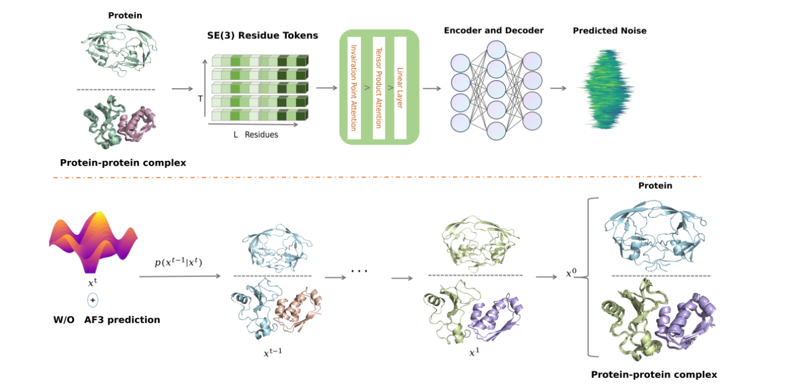

# PTraj-Diff

Implementation of[Efficient Generation of Protein and Protein-Protein Complex Dynamics via SE(3)-Parameterized Diffusion Models]




## Installation

```
pip install torch==2.4.0 torchvision==0.19.0 torchaudio==2.4.0 --index-url https://download.pytorch.org/whl/cu121 
pip install pytorch_lightning==2.0.4 mdtraj==1.9.9 biopython==1.79
pip install wandb dm-tree einops torchdiffeq pyEMMA torchtyping transformer
pip install matplotlib==3.7.2 numpy==1.23.5  pandas==1.5.3

```

## Model weights
The model weights used in the paper may be downloaded here:

```
https://drive.google.com/drive/folders/1vrmGUiZlDqikxunZY_C7HnjdfZk3ToSc?usp=sharing

```

## Inference
```
# protein
python  sim_inference_bert.py   --sim_ckpt  path/weights   --output_dir  path/to/save   --num_frames 3000  --split splits/chain_test_split.csv --num_rollouts 1 --xtc  --suffix _i10   --af3 --base_path_cif  sim_data/1phv
```

```
# protein-protein complex
python  sim_inference_bert.py   --sim_ckpt  path/weights   --output_dir  path/to/save   --num_frames 3000  --split splits/ppmid_test_x.csv --num_rollouts 1 --xtc --suffix _i10  --af3 --base_path_cif  sim_data/1brs
```
 
## MD topology and coordinates
The topology and coordinates files are downloaded from: 
```
 https://drive.google.com/drive/folders/1OrUq6BedZu9XyTolMmL0VkJrLYRCuQQn?usp=sharing
```

## Model Metrics

### DockQ
DockQ: A Quality Measure for Protein-Protein Docking Models

https://github.com/bjornwallner/DockQ

*  Basu, S. and Wallner, B., 2016. DockQ: a quality measure for protein-protein docking models. PloS one, 11(8), p.e0161879.
*  Mirabello, C. and Wallner, B., 2024. DockQ v2: Improved automatic quality measure for protein multimers, nucleic acids, and small molecules. bioRxiv, pp.2024-05.  

```
pip install DockQ
DockQ examples/1A2K_r_l_b.model.pdb examples/1A2K_r_l_b.pdb
```


### TM-Score

```
wget https://zhanggroup.org/TM-score/TMscore.cpp
g++ -static -O3 -ffast-math -lm -o TMscore TMscore.cpp
TMscore model.pdb native.pdb
```

## Acknowledgement
```
The code is based on the following repositories:
https://github.com/bjing2016/mdgen.git

```

## Lincense
```
Code is released under MIT LICENSE.
```

## Citation

*  Jianmin Wang, Xun Wang, Yanyi Chu, Chunyan Li, Xue Li, Xiangyu Meng, Yitian Fang, Kyoung Tai No, Jiashun Mao, Xiangxiang Zeng. **"Exploring the conformational ensembles of protein-protein complex with transformer-based generative model."** Journal of Chemical Theory and Computation; doi: https://doi.org/10.1021/acs.jctc.4c00255


